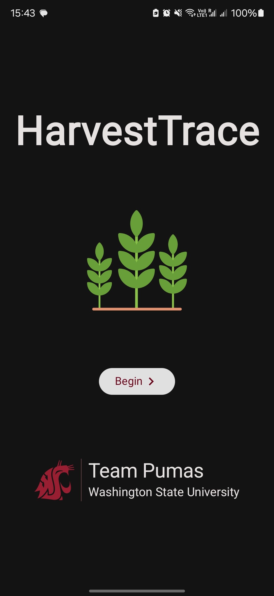
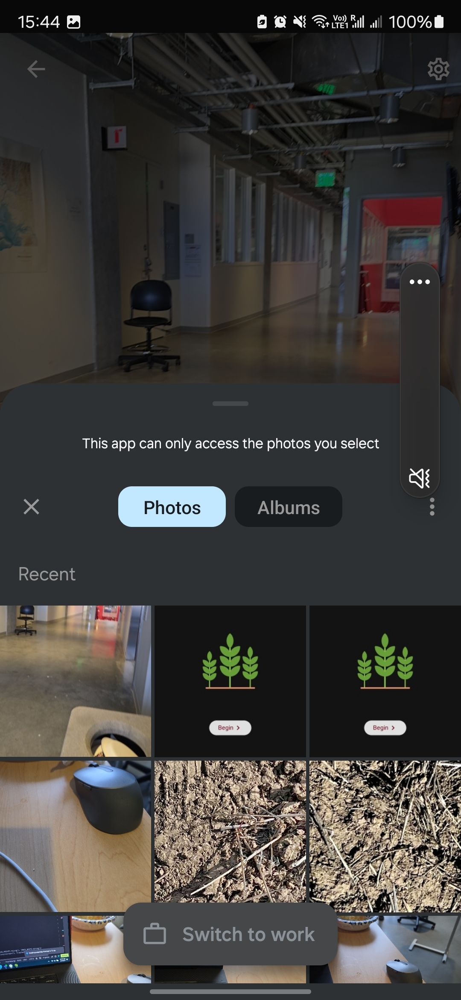
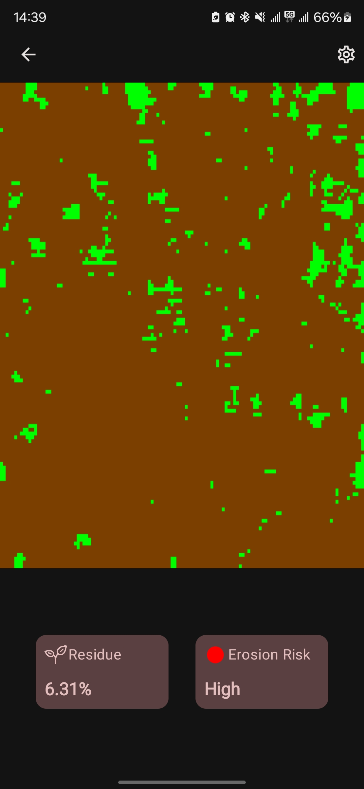

# HarvestTrace
Harvest Trace is a mobile application that estimates crop residue coverage on the ground using the device's camera. It utilizes on-device machine learning to distinguish crop residue from the background and calculates the residue percentage relative to the background.

## Screenshots

|  |  |  |  |
|--------------------------------------|---------------------------------------------|-----------------------------------------|---------------------------|
